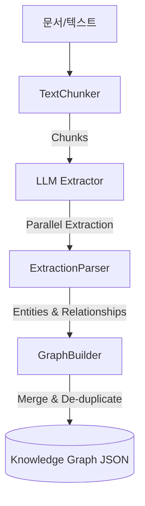
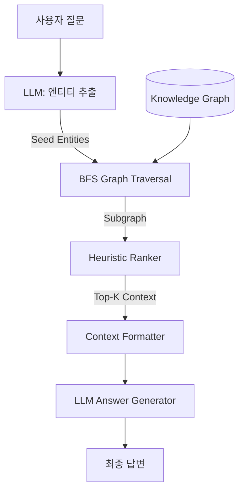
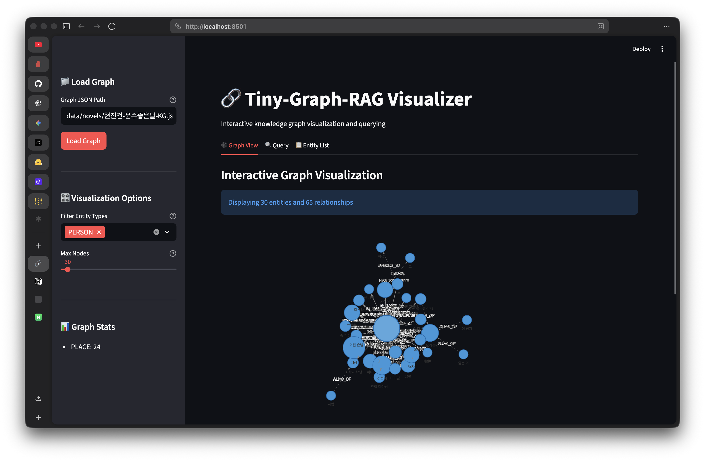
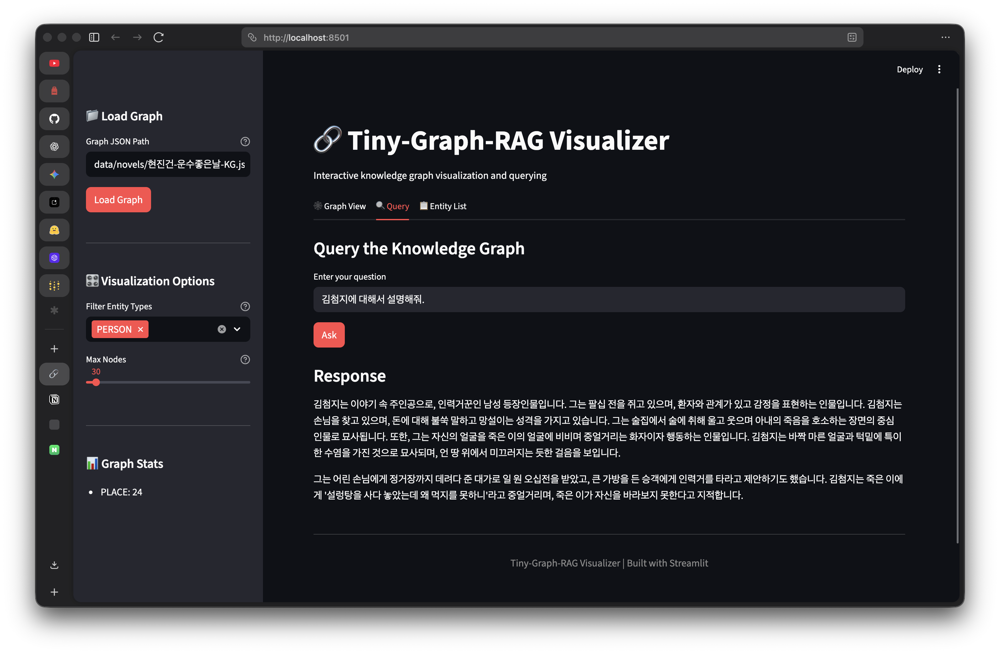

# 🔗 Tiny-Graph-RAG

Tiny-Graph-RAG는 OpenAI API를 활용하여 문서로부터 지식 그래프(Knowledge Graph)를 구축하고, 이를 기반으로 답변을 생성하는 경량 Graph-based RAG 구현체입니다.

단순한 벡터 검색(Vector Search)의 한계를 넘어, 문서 내 엔티티 간의 관계를 구조화하여 더 깊이 있고 설명 가능한 답변을 제공하는 것을 목표로 합니다.

## 🚀 파이프라인 (Architecture)

### 1. 지식 그래프 구축 (Ingestion Pipeline)
문서에서 의미 있는 정보를 추출하여 구조화된 그래프 데이터로 변환하는 과정입니다.



### 2. 검색 및 답변 생성 (Query Pipeline)
사용자의 질문에 대해 그래프를 탐색하고 관련 있는 서브그래프를 추출하여 답변을 생성합니다.



## ✨ 주요 기능

- **지능형 엔티티/관계 추출**: OpenAI GPT 모델을 활용해 비정형 텍스트에서 엔티티와 관계를 정밀하게 추출합니다.
- **비동기 배치 처리**: `asyncio.gather`를 통해 대량의 텍스트 청크를 병렬로 처리하여 지식 그래프 구축 속도를 높였습니다.
- **그래프 정규화 및 병합**: 동일한 엔티티가 여러 청크에서 발견될 경우, 이름 정규화 및 병합 로직을 통해 하나의 노드로 통합합니다.
- **다중 홉 탐색 및 랭킹**: 질문과 관련된 엔티티로부터 BFS(Breadth-First Search) 탐색을 수행하고, 관련성 기반 휴리스틱 랭킹을 통해 최적의 컨텍스트를 구성합니다.
- **인터랙티브 시각화**: PyVis 및 Streamlit-Agraph를 지원하여 구축된 그래프를 웹 브라우저에서 직접 탐색할 수 있습니다.

## 📸 스크린샷 (Screenshots)

| 지식 그래프 시각화 | 질문 및 답변 생성 |
|:---:|:---:|
|  |  |

## 🛠️ 설치 방법

이 프로젝트는 `uv` 또는 `pip`을 사용하여 설치할 수 있습니다.

```bash
# 저장소 복제
git clone https://github.com/your-repo/tiny-graph-RAG.git
cd tiny-graph-RAG

# 가상환경 구축 및 패키지 설치
uv sync  # uv 사용 시
# 또는
pip install -e .
```

## ⚙️ 설정 (Configuration)

`.env` 파일이나 `config.yaml` 파일을 통해 설정할 수 있습니다.

```bash
# .env 설정
export OPENAI_API_KEY='your-api-key-here'
```

또는 `config.yaml` 수정:
```yaml
openai:
  model: "gpt-4o-mini"
  temperature: 0.0
chunking:
  chunk_size: 1000
  chunk_overlap: 200
```

## 💻 사용 방법

### CLI 모드

**1. 문서 처리 (그래프 생성)**
```bash
python main.py process data/novels/김유정-동백꽃.txt -o graph.json
```

**2. 질문하기**
```bash
python main.py query "점순이가 주인공에게 왜 감자를 줬어?" -g graph.json
```

**3. 시각화 HTML 생성**
```bash
python main.py visualize -g graph.json -o viz.html
```

### Streamlit 웹 인터페이스
더 편리한 그래프 탐색과 질문을 위해 웹 UI를 실행할 수 있습니다.

```bash
streamlit run streamlit_app.py
```

### 예제 스크립트 실행
단순한 파이썬 스크립트를 통한 추론 예시입니다.
```bash
python inference.py
```

## 🧪 테스트 실행

`pytest`를 사용하여 단위 테스트 및 통합 테스트를 실행할 수 있습니다.

```bash
pytest tests/
```

## 📂 프로젝트 구조

```text
tiny_graph_rag/
├── chunking/      # 텍스트 분할 및 청킹 로직
├── extraction/    # LLM 기반 엔티티/관계 추출 및 파싱
├── graph/         # 지식 그래프 데이터 모델 및 저장 로직
├── llm/           # OpenAI API 클라이언트 및 프롬프트
├── retrieval/     # 그래프 탐색, 랭킹 및 컨텍스트 생성
└── visualization/ # PyVis 기반 시각화 엔진
```

## 📜 라이선스
MIT License
